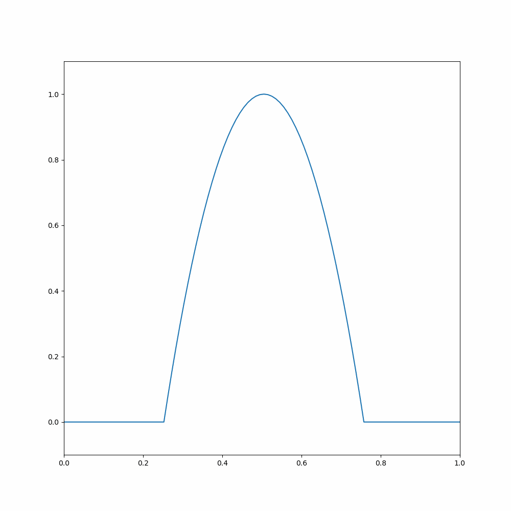
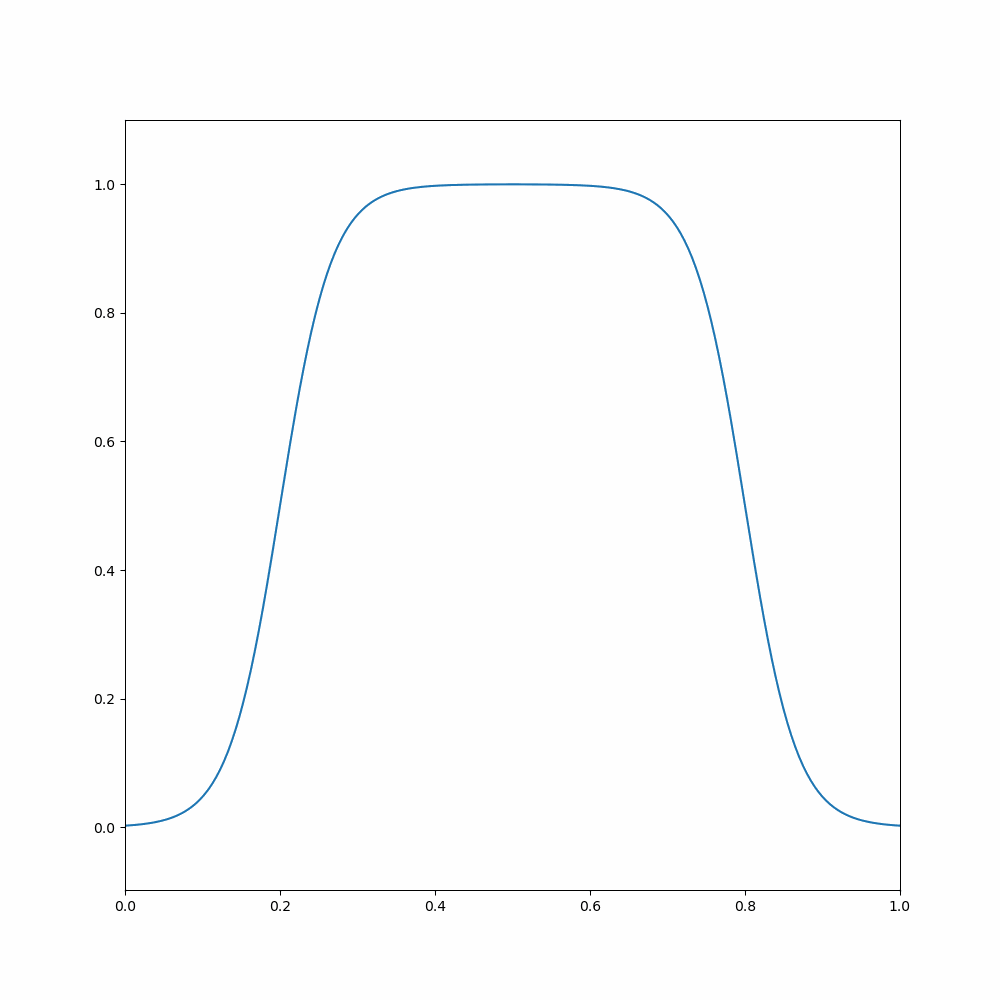

# FDM on PDEs
This repo investigates the numerical solution of partial differential equations (PDEs) commonly found
in various fields, including the heat/diffusion, wave, and Hopf’s equations. Utilizing finite difference methods
implemented in C and utilizing the GNU Scientific Library (GSL). The rapport compares numerical solutions
to analytical solutions. Focusing on the diffusion equation initially, attention is given to different boundary
conditions (BC). The Crank-Nicolson method is highlighted for its stability and conservativeness. Further
exploration includes the effects of a non-constant diffusivity, revealing insights into diffusive behaviors. The
wave equation is subsequently examined, showcasing the numerical and analytical solutions. Lastly, the
Hopf equation is investigated, applaying lax-wendrof scheme. The solution of the Hopfs equation show
non-uniform wavefront movement and the influence of wave density on velocity. 

## Contents

In this repository, you will find:
- Animations
- Pictures
- Gsl code for solving linear systems
- A rapport

## Results

The wave equation with a point source as initial condition  

The advection equation with periodic boundary conditions  
  

Hopf's equation.  
  
We can see that the solution breaks down as the second derivative ceases to exist.

### The Repport can be read [here](https://github.com/albertbayazidi/FDM-on-PDEs/blob/main/rapport.pdf)

